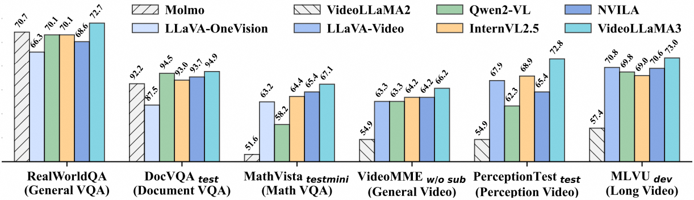
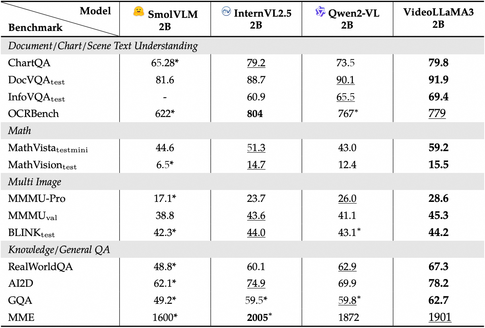
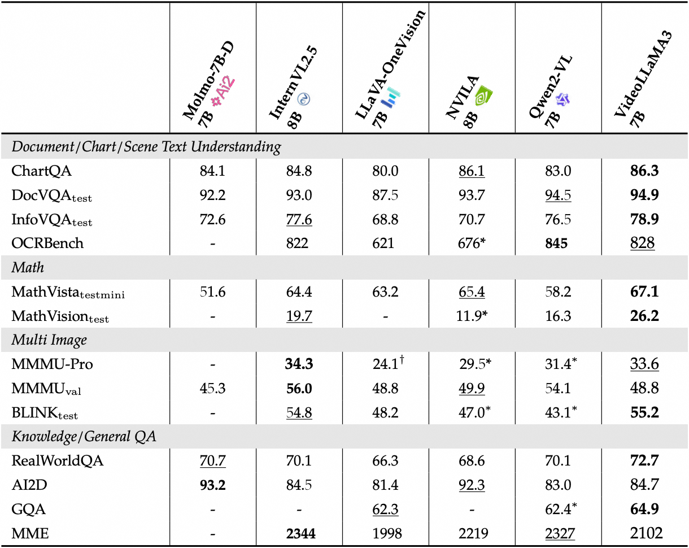

<p align="center">
    
<p>

<h3 align="center"><a href="https://arxiv.org/pdf/2501.13106" style="color:#9C276A">
VideoLLaMA 3: Frontier Multimodal Foundation Models for Video Understanding</a></h3>
<h5 align="center"> If our project helps you, please give us a star ⭐ on GitHub to support us. 🙏🙏 </h2>


<h5 align="center">

[](https://huggingface.co/spaces/lixin4ever/VideoLLaMA3-Image)
[](https://huggingface.co/spaces/lixin4ever/VideoLLaMA3)
[](https://huggingface.co/collections/DAMO-NLP-SG/videollama3-678cdda9281a0e32fe79af15) <br>
[](https://github.com/DAMO-NLP-SG/VideoLLaMA3/blob/main/LICENSE) 
[](https://hits.seeyoufarm.com)
[](https://github.com/DAMO-NLP-SG/VideoLLaMA3/issues?q=is%3Aopen+is%3Aissue)
[](https://github.com/DAMO-NLP-SG/VideoLLaMA3/issues?q=is%3Aissue+is%3Aclosed)  <br>
[](https://huggingface.co/papers/2501.13106)
[](https://arxiv.org/abs/2501.13106) 
</h5>

<details open><summary>💡 Some other multimodal-LLM projects from our team may interest you ✨. </summary><p>
<!--  may -->

> [**VideoLLaMA 2: Advancing Spatial-Temporal Modeling and Audio Understanding in Video-LLMs**](https://github.com/DAMO-NLP-SG/VideoLLaMA2) <br>
> Zesen Cheng*, Sicong Leng*, Hang Zhang*, Yifei Xin*, Xin Li*, Guanzheng Chen, Yongxin Zhu, Wenqi Zhang, Ziyang Luo, Deli Zhao, Lidong Bing <br>
[](https://github.com/DAMO-NLP-SG/VideoLLaMA2)  [](https://github.com/DAMO-NLP-SG/VideoLLaMA2) [](https://arxiv.org/abs/2406.07476) <be> 

> [**VideoRefer Suite: Advancing Spatial-Temporal Object Understanding with Video LLM**](https://arxiv.org/abs/2501.00599) <br>
> Yuqian Yuan, Hang Zhang, Wentong Li, Zesen Cheng, Boqiang Zhang, Long Li, Xin Li, Deli Zhao, Wenqiao Zhang, Yueting Zhuang, Jianke Zhu, Lidong Bing <br>
[](https://github.com/DAMO-NLP-SG/VideoRefer)  [](https://github.com/DAMO-NLP-SG/VideoRefer)  [](https://arxiv.org/abs/2501.00599) <br>

> [**VCD: Mitigating Object Hallucinations in Large Vision-Language Models through Visual Contrastive Decoding**](https://arxiv.org/abs/2311.16922) <br>
> Sicong Leng*, Hang Zhang*, Guanzheng Chen, Xin Li, Shijian Lu, Chunyan Miao, Lidong Bing <br>
[](https://github.com/DAMO-NLP-SG/VCD)  [](https://github.com/DAMO-NLP-SG/VCD)  [](https://arxiv.org/abs/2311.16922) <br>

> [**The Curse of Multi-Modalities: Evaluating Hallucinations of Large Multimodal Models across Language, Visual, and Audio**](https://arxiv.org/abs/2410.12787) <br>
> Sicong Leng*, Yun Xing*, Zesen Cheng*, Yang Zhou, Hang Zhang, Xin Li, Deli Zhao, Shijian Lu, Chunyan Miao, Lidong Bing <br>
[](https://github.com/DAMO-NLP-SG/CMM)  [](https://github.com/DAMO-NLP-SG/CMM)  [](https://arxiv.org/abs/2410.12787) <br>

> [**Breaking the Memory Barrier: Near Infinite Batch Size Scaling for Contrastive Loss**](https://arxiv.org/abs/2410.17243) <br>
> Zesen Cheng*, Hang Zhang*, Kehan Li*, Sicong Leng, Zhiqiang Hu, Fei Wu, Deli Zhao, Xin Li, Lidong Bing <br>
[](https://github.com/DAMO-NLP-SG/Inf-CLIP)  [](https://github.com/DAMO-NLP-SG/Inf-CLIP)  [](https://arxiv.org/abs/2410.17243) <br>


</p></details>


## 📰 News

* **[2025.02.07]**  🔥🔥 Release our re-captioned high-quality image-text dataset [VL3-Syn7M](https://huggingface.co/datasets/DAMO-NLP-SG/VL3-Syn7M).
* **[2025.01.26]**  🔥🔥 As of Jan 26, VideoLLaMA3-7B is the best 7B-sized model on [LVBench](https://huggingface.co/spaces/THUDM/LVBench) leaderboard.
* **[2025.01.24]**  🔥🔥 As of Jan 24, VideoLLaMA3-7B is the best 7B-sized model on [VideoMME](https://video-mme.github.io/home_page.html) leaderboard.
* **[2025.01.22]**  👋👋 Release technical report of VideoLLaMA 3. If you have works closely related to VideoLLaMA 3 but not mentioned in the paper, feel free to let us know.
* **[2025.01.21]**  Release models and inference code of VideoLLaMA 3.

## 🌟 Introduction
VideoLLaMA 3 is a series of multimodal foundation models with frontier image and video understanding capacity.



<details>
  <summary>💡Click here to show detailed performance on video benchmarks</summary>
  
  
</details>

<details>
  <summary>💡Click here to show detailed performance on image benchmarks</summary>
  
  
</details>

## 🛠️ Requirements and Installation

Basic Dependencies:

* Python >= 3.10
* Pytorch >= 2.4.0
* CUDA Version >= 11.8
* transformers >= 4.46.3

Install required packages:

**[Inference-only]**

```bash
pip install torch==2.4.0 torchvision==0.17.0 --extra-index-url https://download.pytorch.org/whl/cu118

pip install flash-attn --no-build-isolation
pip install transformers==4.46.3 accelerate==1.0.1
pip install decord ffmpeg-python imageio opencv-python
```

**[Training]**

```bash
git clone https://github.com/DAMO-NLP-SG/VideoLLaMA3
cd VideoLLaMA3
pip install -r requirements.txt
pip install flash-attn --no-build-isolation
```

## :earth_americas: Model Zoo

| Model                | Base Model   | HF Link                                                      |
| -------------------- | ------------ | ------------------------------------------------------------ |
| VideoLLaMA3-7B       | Qwen2.5-7B   | [DAMO-NLP-SG/VideoLLaMA3-7B](https://huggingface.co/DAMO-NLP-SG/VideoLLaMA3-7B) |
| VideoLLaMA3-2B       | Qwen2.5-1.5B | [DAMO-NLP-SG/VideoLLaMA3-2B](https://huggingface.co/DAMO-NLP-SG/VideoLLaMA3-2B) |
| VideoLLaMA3-7B-Image | Qwen2.5-7B   | [DAMO-NLP-SG/VideoLLaMA3-7B-Image](https://huggingface.co/DAMO-NLP-SG/VideoLLaMA3-7B-Image) |
| VideoLLaMA3-2B-Image | Qwen2.5-1.5B | [DAMO-NLP-SG/VideoLLaMA3-2B-Image](https://huggingface.co/DAMO-NLP-SG/VideoLLaMA3-2B-Image) |

We also upload the tuned vision encoder of VideoLLaMA3-7B for wider application:

| Model                         | Base Model                | HF Link                                                      |
| ----------------------------- | ------------------------- | ------------------------------------------------------------ |
| VideoLLaMA3-7B Vision Encoder | siglip-so400m-patch14-384 | [DAMO-NLP-SG/VL3-SigLIP-NaViT](https://huggingface.co/DAMO-NLP-SG/VL3-SigLIP-NaViT) |

## 🤖 Inference

```python
import torch
from transformers import AutoModelForCausalLM, AutoProcessor

device = "cuda:0"
model_path = "DAMO-NLP-SG/VideoLLaMA3-7B"
model = AutoModelForCausalLM.from_pretrained(
    model_path,
    trust_remote_code=True,
    device_map={"": device},
    torch_dtype=torch.bfloat16,
    attn_implementation="flash_attention_2",
)
processor = AutoProcessor.from_pretrained(model_path, trust_remote_code=True)

conversation = [
    {"role": "system", "content": "You are a helpful assistant."},
    {
        "role": "user",
        "content": [
            {"type": "video", "video": {"video_path": "./assets/cat_and_chicken.mp4", "fps": 1, "max_frames": 128}},
            {"type": "text", "text": "What is the cat doing?"},
        ]
    },
]

inputs = processor(
    conversation=conversation,
    add_system_prompt=True,
    add_generation_prompt=True,
    return_tensors="pt"
)
inputs = {k: v.to(device) if isinstance(v, torch.Tensor) else v for k, v in inputs.items()}
if "pixel_values" in inputs:
    inputs["pixel_values"] = inputs["pixel_values"].to(torch.bfloat16)
output_ids = model.generate(**inputs, max_new_tokens=128)
response = processor.batch_decode(output_ids, skip_special_tokens=True)[0].strip()
print(response)
```

For more cases, please refer to [examples](https://github.com/DAMO-NLP-SG/VideoLLaMA3/blob/main/inference/example_videollama3.py).

### CookBook
Checkout [inference notebooks](inference/notebooks/) that demonstrate how to use VideoLLaMA3 on various applications such as single-image understanding, multi-image understanding, visual referring and grounding, video understanding, etc.

| Notebooks                | Description   |
| :-------------------- | ------------------------------------------------------------------------ |
| [Image Understanding](https://github.com/DAMO-NLP-SG/VideoLLaMA3/blob/main/inference/notebooks/01_single_image_understanding.ipynb)      | Demonstrations of using VideoLLaMA 3 for **general image understanding**, **chart analysis**, **table understanding**, **document recognition**, and **visual code analysis**|
| [Multi-image Understanding](https://github.com/DAMO-NLP-SG/VideoLLaMA3/blob/main/inference/notebooks/02_multi_image_understanding.ipynb)       | Demonstrations of using VideoLLaMA 3 for **multi-image comparison and understanding** |
| [Fine-grained Image Recognition & Understanding](https://github.com/DAMO-NLP-SG/VideoLLaMA3/blob/main/inference/notebooks/03_visual_referring_and_grounding.ipynb) | Demonstrations of using VideoLLaMA 3 for **visual referring & grounding** |
| [Video Understanding](https://github.com/DAMO-NLP-SG/VideoLLaMA3/blob/main/inference/notebooks/04_video_understanding.ipynb) | Demonstrations of using VideoLLaMA 3 for **general video understanding**, **long video understanding** and **temporal grounding** |


## 🤗 Demo

It is highly recommended to try our [online demo](https://huggingface.co/spaces/lixin4ever/VideoLLaMA3) first.

Otherwise, you can launch a gradio app locally:

```bash
python inference/launch_gradio_demo.py --model-path DAMO-NLP-SG/VideoLLaMA3-7B

options:
  --model-path MODEL_PATH, --model_path MODEL_PATH
  --server-port SERVER_PORT, --server_port SERVER_PORT
  	Optional. Port of the model server.
  --interface-port INTERFACE_PORT, --interface_port INTERFACE_PORT
  	Optional. Port of the gradio interface.
  --nproc NPROC
  	Optional. Number of model processes.
```

## 🗝️ Training

### Step 1: Prepare training data
To use our training code, please organize the image and video data as you like under `data_root`, and then use one or more annotation files to record each conversation data and the corresponding image/video path. For example:
```bash
data_root
├── LLaVA-Video-178K
│   ├── video_1.mp4
│   └── ...
├── LLaVA-OneVision-Data
│   ├── image_1.jpg
│   └── ...
├── annotations_video.jsonl
├── annotations_image.jsonl
└── ...
```
The annotation files are consist of a list of dictionaries, where each item follows the following format:
```json
[
    {
        "video": "images/xxx.jpg",
        "conversations": [
            {
                "from": "human",
                "value": "<image>\nWhat are the colors of the bus in the image?"
            },
            {
                "from": "gpt",
                "value": "The bus in the image is white and red."
            },
            ...
        ],
    }
    {
        "video": "videos/xxx.mp4",
        "conversations": [
            {
                "from": "human",
                "value": "<video>\nWhat are the main activities that take place in the video?"
            },
            {
                "from": "gpt",
                "value": "The main activities that take place in the video are the preparation of camera equipment by a man, a group of men riding a helicopter, and a man sailing a boat through the water."
            },
            ...
        ],
    },
    ...
]
```
For loading and memory efficiency, we recommend to use `.jsonl` files with [huggingface datasets](https://huggingface.co/docs/datasets/loading) format.
### Step 2: Prepare training script
We provide some templates in `scripts/train` for all stages. You can modify the variables to fit your settings of data and models based on them. For example:
```bash
  --data_folder ./datasets \
  --data_path ./datasets/annotations_video.jsonl ./datasets/annotations_image.jsonl \
  --model_path Qwen/Qwen2.5-1.5B-Instruct \
  --vision_encoder DAMO-NLP-SG/SigLIP-NaViT \
```
### Step 3: Start training
Now you can start training with your training scripts:
```bash
# VideoLLaMA3 Stage 1
bash scripts/train/stage1_2b.sh
# VideoLLaMA3 Stage 2
bash scripts/train/stage2_2b.sh
```


## ✅ Evaluation
#### Step 1: Prepare evaluation data
First, please download the corresponding data according to the official instructions and organize it into the following format:
<details>
<summary>Click here to view the dataset directory organization</summary>

```bash
benchmarks
└── video
│   ├── activitynet_qa
│   │   ├── all_test
│   │   ├── test_a.json
│   │   └── test_q.json
│   ├── charades
│   │   ├── Charades_v1
│   │   └── charades_annotations_test-random_prompt.json
│   ├── egoschema
│   │   ├── good_clips_git
│   │   └── questions.json
│   ├── longvideobench
│   │   ├── lvb_val.json
│   │   ├── subtitles
│   │   └── videos
│   ├── lvbench
│   │   ├── video
│   │   └── video_info.meta.jsonl
│   ├── mlvu
│   │   ├── json
│   │   └── video
│   ├── mvbench
│   │   ├── json
│   │   └── video
│   ├── nextqa
│   │   ├── map_vid_vidorID.json
│   │   ├── NExTVideo
│   │   └── test.csv
│   ├── perception_test
│   │   ├── mc_question_test.json
│   │   └── videos
│   ├── tempcompass
│   │   ├── captioning
│   │   ├── caption_matching
│   │   ├── multi-choice
│   │   ├── videos
│   │   └── yes_no
│   ├── videomme
│   │   ├── subtitles
│   │   ├── test-00000-of-00001.parquet
│   │   └── videos
```

</details>

#### Step 2: Start evaluation
```bash
bash scripts/eval/eval_video.sh ${MODEL_PATH} ${BENCHMARKS} ${NUM_NODES} ${NUM_GPUS}
```
You can change the directory of benchmarks and outputs via `DATA_ROOT` and `SAVE_DIR` in the evaluation script. Please check the scripts for more detailed usage.

#### Step 3: Add new benchmark
Coming soon...


## 📑 Citation

If you find VideoLLaMA useful for your research and applications, please cite using this BibTeX:

```bibtex
@article{damonlpsg2025videollama3,
  title={VideoLLaMA 3: Frontier Multimodal Foundation Models for Image and Video Understanding},
  author={Boqiang Zhang, Kehan Li, Zesen Cheng, Zhiqiang Hu, Yuqian Yuan, Guanzheng Chen, Sicong Leng, Yuming Jiang, Hang Zhang, Xin Li, Peng Jin, Wenqi Zhang, Fan Wang, Lidong Bing, Deli Zhao},
  journal={arXiv preprint arXiv:2501.13106},
  year={2025},
  url = {https://arxiv.org/abs/2501.13106}
}

@article{damonlpsg2024videollama2,
  title={VideoLLaMA 2: Advancing Spatial-Temporal Modeling and Audio Understanding in Video-LLMs},
  author={Cheng, Zesen and Leng, Sicong and Zhang, Hang and Xin, Yifei and Li, Xin and Chen, Guanzheng and Zhu, Yongxin and Zhang, Wenqi and Luo, Ziyang and Zhao, Deli and Bing, Lidong},
  journal={arXiv preprint arXiv:2406.07476},
  year={2024},
  url = {https://arxiv.org/abs/2406.07476}
}

@article{damonlpsg2023videollama,
  title = {Video-LLaMA: An Instruction-tuned Audio-Visual Language Model for Video Understanding},
  author = {Zhang, Hang and Li, Xin and Bing, Lidong},
  journal = {arXiv preprint arXiv:2306.02858},
  year = {2023},
  url = {https://arxiv.org/abs/2306.02858}
}
```

## 👍 Acknowledgement
Our VideoLLaMA3 is built on top of [**SigLip**](https://huggingface.co/google/siglip-so400m-patch14-384) and [**Qwen2.5**](https://github.com/QwenLM/Qwen2.5). We also learned a lot from the implementation of [**LLaVA-OneVision**](https://github.com/LLaVA-VL/LLaVA-NeXT), [**InternVL2**](https://internvl.github.io/blog/2024-07-02-InternVL-2.0/), and [**Qwen2VL**](https://github.com/QwenLM/Qwen2-VL). Besides, our VideoLLaMA3 benefits from tons of open-source efforts. We sincerely appreciate these efforts and compile a list in [ACKNOWLEDGEMENT.md](https://github.com/DAMO-NLP-SG/VideoLLaMA3/blob/main/ACKNOWLEDGEMENT.md) to express our gratitude. If your work is used in VideoLLaMA3 but not mentioned in either this repo or the technical report, feel free to let us know :heart:.


## 🔒 License

This project is released under the Apache 2.0 license as found in the LICENSE file.
The service is a research preview intended for **non-commercial use ONLY**, subject to the model Licenses of Qwen, Terms of Use of the data generated by OpenAI and Gemini, and Privacy Practices of ShareGPT. Please get in touch with us if you find any potential violations.
